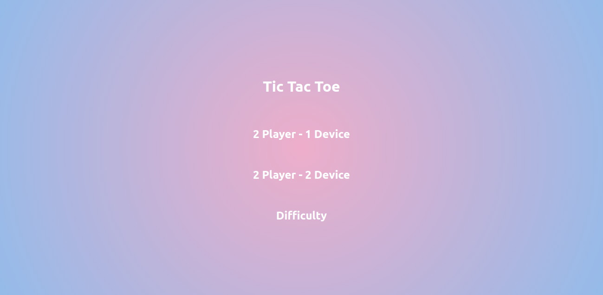
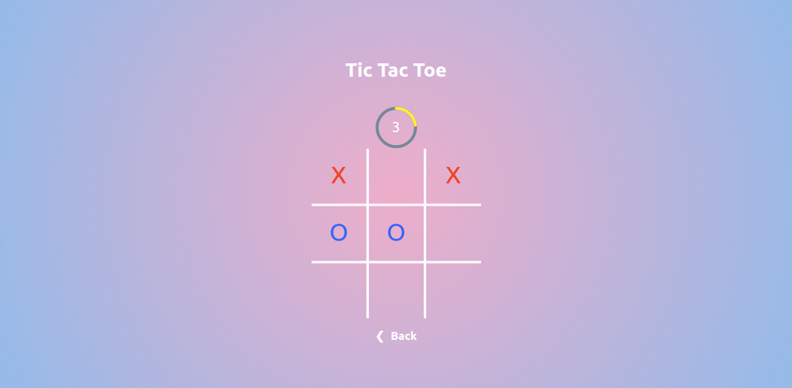

# Tic-Tac-Toe (React Application)
A Tic Tac Toe application created using React and Websockets
It comprises of two gaming modes 
- Two player One Device
- Two Player Two Device

The game has 3 levels of difficulty with different time limit of the player to make their move.
- Easy (10 seconds)
- Medium (7 seconds)
- Hard (5 seconds)

## Installation

``` npm install ```

## Screen Shots

### Home Screen


### Two Player One Device 



